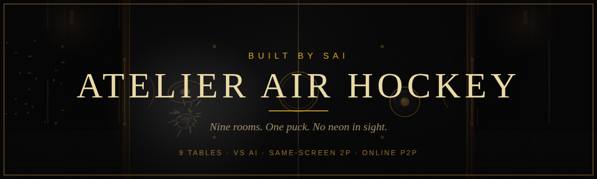
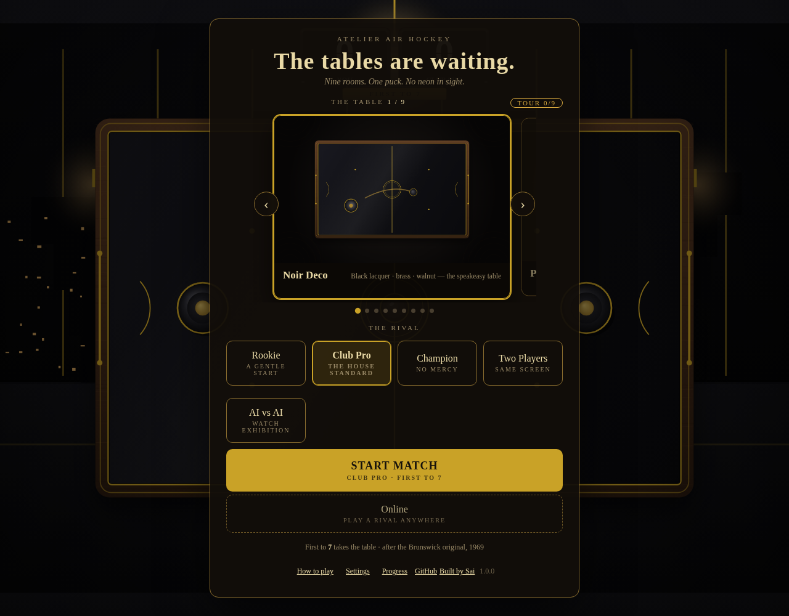
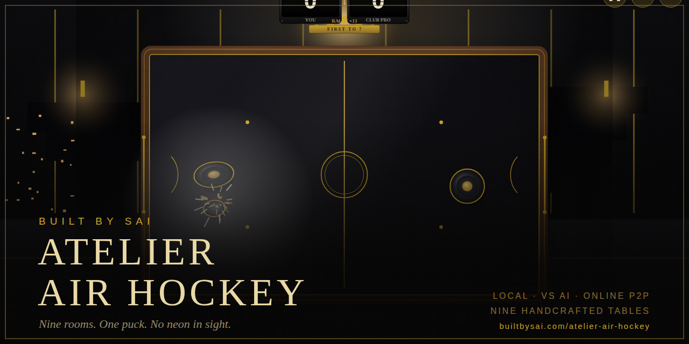

*Nine rooms. One puck. No neon in sight.*

**Play:** https://builtbysai.com/atelier-air-hockey/

A handcrafted browser air-hockey game. Nine art-directed tables, each a different design movement with its own room, scoreboard device, and ambience. Local rivals, same-screen two-player, AI-vs-AI exhibition, and peer-to-peer online matches in the browser. No account, no download.

## The tables

| Table | The room |
|---|---|
| Noir Deco | Black lacquer, brass, walnut · the speakeasy table |
| Palm Springs '62 | Walnut, brass, cream laminate · the Eichler game room |
| Beton | Raw concrete, aluminum, safety orange · the bunker table |
| The Billiard Room | Mahogany, brass, snooker green · the members' club table |
| Memphis Milano | Laminate confetti, squiggles · the loft party, 1981 |
| Wabi-Sabi Sashiko | Indigo thread, pine rails · the machiya |
| Bauhaus Dessau '23 | Tubular steel, primaries · the workshop stage, 1923 |
| Zellige Riad | Cobalt stars, terracotta · the courtyard fountain, Marrakech |
| Swiss Grid | Paper white, black rules · the Zurich gallery, 1957 |




## Ways to play

- **Vs the house:** three AI rivals · Rookie (a gentle start), Club Pro (the house standard), Champion (no mercy).
- **Two players, one screen:** same-device head-to-head.
- **AI vs AI exhibition:** pick a difficulty per side and watch the machines play.
- **Online:** peer-to-peer matches over WebRTC. Host a table, share the six-character invite code or link, and play. The host's device runs the physics; if a connection drops you get a short reconnect grace period.
- **Attract mode:** leave the menu alone for a few seconds and the house plays itself.

Win on every table to complete the **Table Tour**. Records, personal bests (fastest win, top speed, longest rally, biggest margin), and five achievements persist on your device.

## Table rules

Tune the room in Settings · everything saves on this device:

- First to 5, 7, or 11
- Puck pace: Casual, Classic, Lightning
- Goal mouth: Narrow, Standard, Wide
- Screen shake, effects scale, sound, haptics

## Controls

- Mouse / touch: direct mallet control.
- Keyboard: WASD for player one; arrow keys for player two.
- Gamepads: pad one drives player one; pad two drives player two.
- P: pause/resume. M: mute/unmute. Esc: close the current dialog or pause/resume.

Deep links: `?table=sashi&play`, `?2p`, `?demo`, `?join=CODE`.

## Online play

Online matches use Trystero 0.25 / WebRTC with Nostr signaling. The host is authoritative for physics and match settings. Rooms use a six-character invite code, bind one rival, validate inbound state, and give a short reconnect grace period for transient drops. No account is required.

## Privacy and local data

Offline play makes no game-network request. Online play loads Trystero and uses WebRTC, Nostr signaling relays, and TURN when needed to establish the peer-to-peer session. Settings, records, personal bests, achievements, and table-tour progress stay in this browser via `localStorage` and can be reset from Progress.

## Development

`src/` is the source of truth. The runtime is split into `themes.js`, `scoreboards.js`, `net.js`, `game.js`, and `ui.js`, with `styles.css` and `template.html` as the page shell. Root `index.html` is generated from `src/template.html` for GitHub Pages.

```bash
npm run build
npm test
```

CI checks source/build consistency, core stabilization invariants, and JavaScript syntax. Identity assets (banner, social preview, SVG sources) live in `docs/identity/`; gameplay screenshots in `docs/screenshots/`.

## License

See [LICENSE](./LICENSE).
