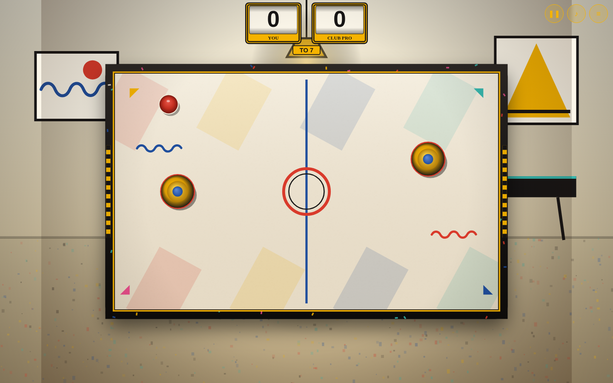
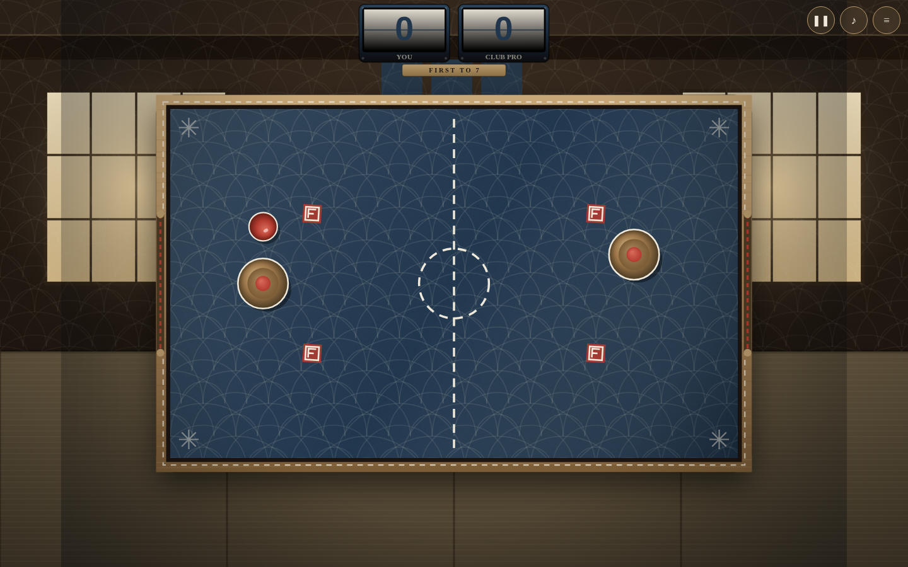
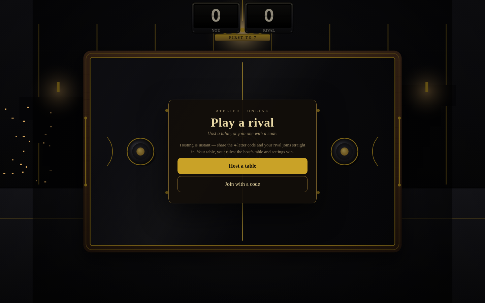

# Atelier Air Hockey

A premium, fully self-contained web air-hockey game. Six hand-designed tables, a 240 Hz physics core, three AI rivals, local two-player, online multiplayer, and a proper menu / settings / match flow — in a single HTML file with zero dependencies and zero network requests until you tap Online.

**Play it now:** https://builtbysai.com/atelier-air-hockey/

## The tables

| Table | Character |
|---|---|
| **Noir Deco** | Black lacquer, brass inlay, walnut rails — a 1930s club room |
| **Palm Springs '62** | Cream laminate, walnut, brass — mid-century poolside |
| **Beton** | Raw concrete, aluminum, safety orange — brutalist |
| **The Billiard Room** | Mahogany, brass, snooker green — the old hall |
| **Memphis Milano** | Warm cream laminate, primary geometry — Milan, 1981 |
| **Wabi-Sabi Sashiko** | Indigo textile, stitch-work, pine rails — the machiya |

Each table has its own palette, typography, physical scoring device, sound tuning, and background room. Menu previews are painted live from the same renderers — what you see is what you play.

## Scoring devices

Every table keeps score the way its world would:

- **Solari split-flap** — Noir Deco, Wabi-Sabi Sashiko. Analog flaps clatter through the digits with a half-flap settle.
- **Electromechanical score reels** — Palm Springs '62, Memphis Milano. Spring-driven odometer drums with a reel-spin flicker.
- **Mahogany cribbage peg track** — The Billiard Room. Brass pegs hop forward along a 60-hole track.
- **5×7 incandescent bulb matrix** — Beton. Grandstand-style dots that roll upward with a filament cool-down fade.

All devices show the **First to N** target, a match-point treatment, and solo/two-player labels.

## Play

- **Solo** — pick your rival: Rookie (a gentle start), Club Pro (the house standard), or Champion (no mercy).
- **Two Players** — same screen, two mallets. Top half vs bottom half on desktop; split-screen drag on touch.
- Drag the mallet to glide, flick to drive. Slow the mallet over the puck to smother and possess it; whip through it for the lively driven hit.

## Settings (saved on your device)

- **Screen shake** — Off / Subtle / Full
- **Sound** — on/off (all audio is synthesized live with WebAudio — no files)
- **Haptics** — on/off (mobile vibration on hits and goals)
- **First to** — 5 / 7 / 11 (scoreboards and match flow adapt)
- **Puck pace** — Casual / Classic / Lightning (damping, rail liveliness, serve speed)

## Match flow

Countdown serve, goal slow-motion with letterbox ceremony and chord, match-point ribbons ("NEXT GOAL WINS"), pause / intermission, and a full-time card with match stats: top puck speed, longest rally, match time. Rematch or change table from the win screen.

## Tech

- **Single file, no build step to play** — open `index.html` (or the versioned file in `releases/`) in any modern browser. No CDN, no fonts, no trackers, no requests.
- **240 Hz fixed-timestep physics** with substeps, speed-dependent mallet restitution, and an anti-stall air jet so the puck never dies in a corner.
- **AI** with guard / defend / engage / windup / strike / recover states, reaction latency, bank shots, pin detection with a two-beat corner escape, and a displacement-based stall backstop — verified with AI-vs-AI stall watches.
- **Game feel** — hit-stop, trauma-based screen shake, particles, squash & stretch, puck trails, scuff marks, goal flash.
- **Rooms** — every table sits in a place-based, pre-rendered room (Skyline Bar, Cabana, Bunker Gallery, Century Club, Loft Party, Machiya). Painted once per resize/theme; one blit per frame, zero per-frame cost.
- **Responsive** — desktop, portrait phones (the rink rotates, your goal goes to the bottom), landscape phones, small screens. No page scroll, no card scroll, at any size.
- **Source** — `src/` holds the real sources (`engine2.js`, `themes.js`, `themes2.js`, `scoreboards.js`, `net.js`, `template2.html`) and `build3.js` inlines them into the single-file release. All netcode is isolated in `net.js` behind a documented protocol (`st` snapshots / `in` input / `ev` events); engine hooks are minimal and marked `// ONLINE:`.

## Online multiplayer

Tap **Online** → **Host a table** and share the 4-letter code, or **Join with a code** to knock on a rival's table. No account, no game server.

- **WebRTC data channels**, peer-to-peer, via **Trystero** (Nostr signaling) — lazy-loaded only when you tap Online, so the base game stays fully self-contained with zero network requests otherwise.
- **Host-authoritative netcode**: the host runs the 240 Hz sim untouched; 25 Hz snapshots; your own mallet stays local (zero input latency); the puck dead-reckons between snapshots with smooth correction.
- **Guest view flip** — the guest always plays from their own bottom side.
- Goals, pause, rematch, and rival-left are synced events, so Solari flaps, score reels, cribbage pegs, and bulb boards animate on both sides together. The host's table and settings win.
- TURN fallback for stubborn NATs uses a locally computed credential — nothing sensitive ships in the file.
- **Ruled out:** Web Bluetooth phone-to-phone (browsers only implement the BLE Central role — two browsers can never link — and Safari/Firefox never shipped Web Bluetooth at all).

## License

MIT — see [LICENSE](LICENSE).
