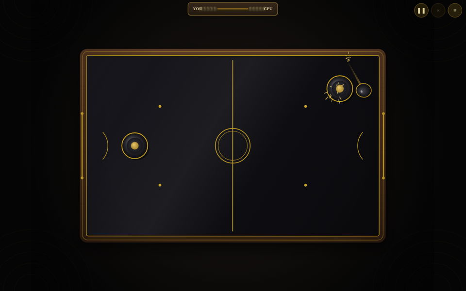
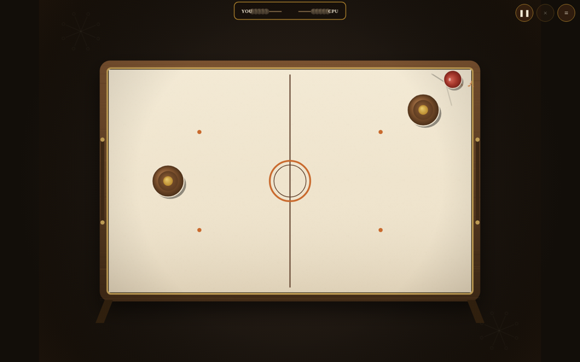
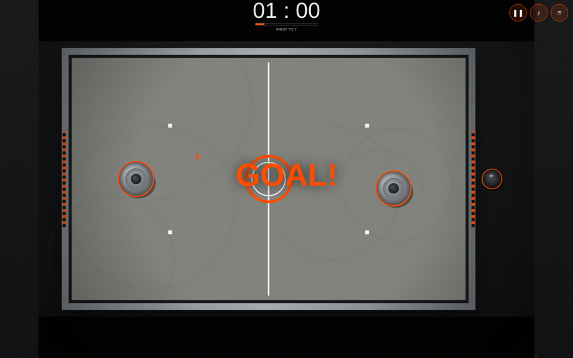
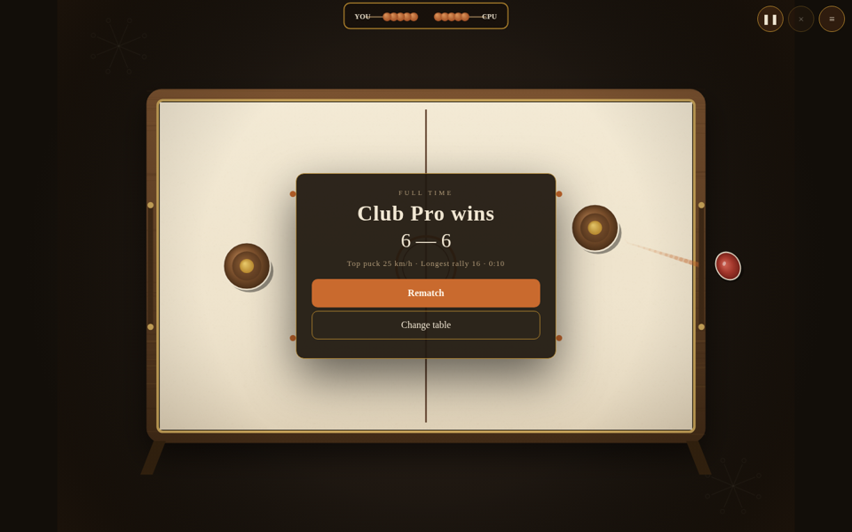

# Atelier Air Hockey

A premium, fully self-contained web air-hockey game. Four hand-designed tables, a 240 Hz physics core, three AI rivals, local two-player, and a proper menu / settings / match flow — in a single HTML file with zero dependencies and zero network requests.

**Play it now:** https://builtbysai.github.io/atelier-air-hockey/

## The tables

| Table | Character |
|---|---|
| **Noir Deco** | Black lacquer, brass inlay, walnut rails — a 1930s club room |
| **Palm Springs '62** | Cream laminate, walnut, brass — mid-century poolside |
| **Beton** | Raw concrete, aluminum, safety orange — brutalist |
| **The Billiard Room** | Mahogany, brass, snooker green — the old hall |

Each table has its own palette, typography, scoreboard (abacus beads, grotesk numerals…), sound tuning, and background room. Thumbnails on the menu are painted live from the same renderers — what you see is what you play.

## Play

- **Solo** — pick your rival: Rookie (a gentle start), Club Pro (the house standard), or Champion (no mercy).
- **Two Players** — same screen, two mallets. Top half vs bottom half on desktop; split-screen drag on touch.
- Drag the mallet to glide, flick to drive. Slow the mallet over the puck to smother and possess it; whip through it for the lively driven hit.

## Settings (saved on your device)

- **Screen shake** — Off / Subtle / Full
- **Sound** — on/off (all audio is synthesized live with WebAudio — no files)
- **Haptics** — on/off (mobile vibration on hits and goals)
- **First to** — 5 / 7 / 11 (scoreboards and match flow adapt)
- **Puck pace** — Casual / Classic / Lightning (damping, rail liveliness, serve speed)

## Match flow

Countdown serve, goal slow-motion with letterbox ceremony and chord, match-point ribbons ("NEXT GOAL WINS"), pause / intermission, and a full-time card with match stats: top puck speed, longest rally, match time. Rematch or change table from the win screen.

## Tech

- **Single file, no build step to play** — open `index.html` (or the versioned file in `releases/`) in any modern browser. No CDN, no fonts, no trackers, no requests.
- **240 Hz fixed-timestep physics** with substeps, speed-dependent mallet restitution, and an anti-stall air jet so the puck never dies in a corner.
- **AI** with guard / defend / engage / windup / strike / recover states, reaction latency, bank shots, and corner escapes — it scores in AI-vs-AI rallies.
- **Game feel** — hit-stop, trauma-based screen shake, particles, squash & stretch, puck trails, scuff marks, goal flash.
- **Responsive** — desktop, portrait phones (the rink rotates, your goal goes to the bottom), landscape phones, small screens. No page scroll, no card scroll, at any size.
- **Source** — `src/` holds the real sources (`engine2.js`, `themes.js`, `template2.html`) and `build2.js` inlines them into the single-file release.

## Online multiplayer — the plan

Online play is on the roadmap. Research is done; the design:

- **WebRTC data channels**, peer-to-peer — no game server, no account, no API key.
- **Trystero** (Nostr signaling) lazy-loaded only when you tap "Play Online", so the base game stays fully self-contained.
- **Host-authoritative netcode**: the room creator runs the 240 Hz sim, 20–30 Hz snapshots; your own mallet stays local (zero input latency), the remote mallet interpolates, the puck dead-reckons between snapshots.
- **Room codes** — host gets a 4-letter code, guest types it in.
- Google STUN primary, Cloudflare Calls TURN as fallback for stubborn NATs.
- **Ruled out:** Web Bluetooth phone-to-phone (browsers only implement the BLE Central role — two browsers can never link — and Safari/Firefox never shipped Web Bluetooth at all).

## License

MIT — see [LICENSE](LICENSE).
