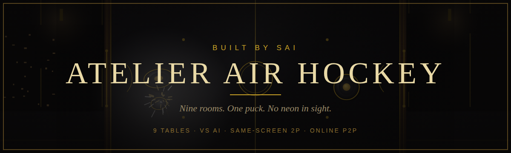
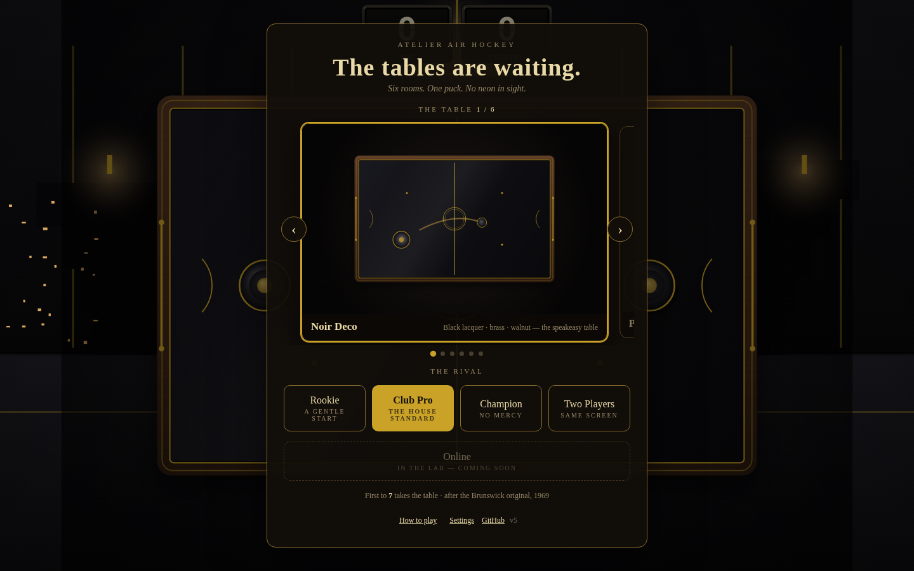
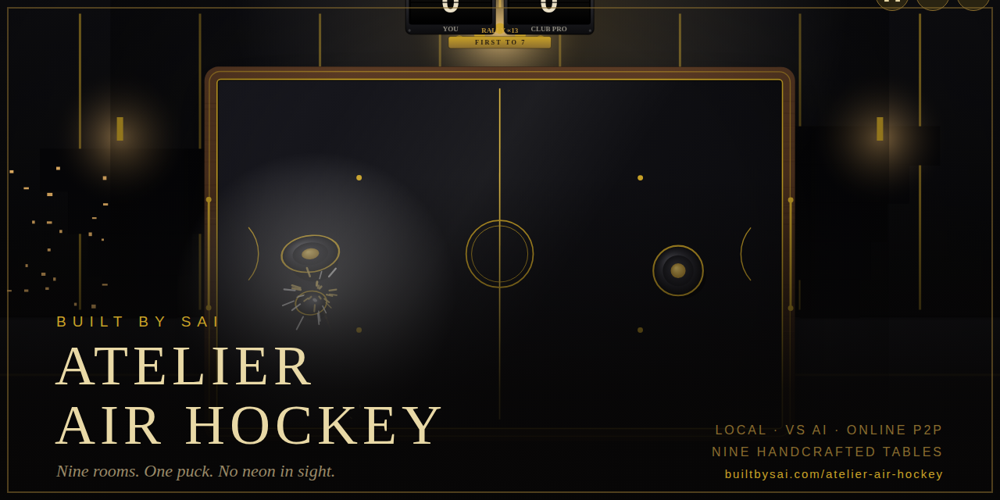

*Ten rooms. One puck. Neon after dark.*

**Play:** https://builtbysai.com/atelier-air-hockey/

A handcrafted browser air-hockey game. Ten art-directed tables, each a different design movement with its own room, scoreboard device, and ambience. Local rivals, same-screen two-player, AI-vs-AI exhibition, and peer-to-peer online matches in the browser. No account required; play in the browser or install it as a PWA.

## The tables

| Table | The room |
|---|---|
| Noir Deco | Black lacquer, brass, walnut · the speakeasy table |
| Palm Springs '62 | Walnut, brass, cream laminate · the Eichler game room |
| Beton | Raw concrete, aluminum, safety orange · the bunker table |
| The Billiard Room | Mahogany, brass, snooker green · the members' club table |
| Memphis Milano | Laminate confetti, squiggles · the loft party, 1981 |
| Wabi-Sabi Sashiko | Indigo thread, pine rails · the machiya |
| Bauhaus Dessau '23 | Tubular steel, primaries · the workshop stage, 1923 |
| Zellige Riad | Cobalt stars, terracotta · the courtyard fountain, Marrakech |
| Swiss Grid | Paper white, black rules · the Zurich gallery, 1957 |
| Neon Atelier | Electric tubes, midnight color · the after-hours room |




## Ways to play

- **Vs the house:** three behavioral rivals · Rookie (counter puncher), Club Pro (placement player), Champion (pressure player).
- **Two players, one screen:** same-device head-to-head.
- **AI vs AI exhibition:** pick a difficulty per side and watch the machines play.
- **Online:** peer-to-peer matches over WebRTC. Host a table, share the six-character invite code or link, and play. The host's device runs the physics; if a connection drops you get a short reconnect grace period.
- **Attract mode:** leave the menu alone for a few seconds and the house plays itself.

The **Table Tour** has mastery progression and alternate unlock paths. Four rooms are open immediately. Memphis, Sashiko, and Bauhaus can be opened by mastering the related previous table or clearing the matching Workshop drill. Zellige, Swiss Grid, and Neon Atelier also accept the previous table's House Challenge or a broader mastered-table count, so progression never becomes a single wall. Beating Rookie, Club Pro, and Champion records increasing mastery for that table, with Champion completing mastery.

Every room also has a concise **House Challenge**, from allowing two goals or fewer in Noir Deco to a 24 km/h + two-goal-margin finish in Neon Atelier. Challenges clear only on a human House win and persist locally.

The **Workshop** uses the same physics as a match:
- **Power:** score at 22 km/h.
- **Control:** trade 10 alternating returns, then 15 and 20 in later stages. Repeated touches by one mallet count once.
- **Keeper:** make 3 saves in a row.
- **Free Hit:** open sandbox for shots, banks, and control.

Cleared drills stay replayable for personal bests. Workshop clears, House Challenges, mastery, records, personal bests (fastest win, top speed, longest rally, biggest margin), and achievements persist on your device.

## Match rules and preferences

Match Rules control the next match:

- First to 5, 7, or 11
- Puck pace: Casual, Classic, Lightning
- Goal mouth: Narrow, Standard, Wide

Preferences control presentation on this device:

- Screen shake and effects scale, including live reduced-motion handling
- Goal replay offer
- Sound plus generative music/room ambience volume
- Haptics
- Camera and orientation

During active matches and replays, supported devices use a screen wake lock. PWA updates are surfaced with a non-blocking update banner and only reload on a safe menu/result surface.

## Controls

- Mouse / touch: direct mallet control.
- Keyboard: WASD for player one; arrow keys for player two.
- Gamepads: pad one drives player one; pad two drives player two.
- P: pause/resume. M: mute/unmute. Esc: close the current dialog or pause/resume.

Deep links: `?table=sashi&play`, `?2p`, `?demo`, `?join=CODE`.

## Replays, highlights, and sharing

Local matches continuously keep a short replay buffer. Player-relevant goals can offer an instant replay without interrupting the goal ceremony, while the result screen selects up to three earned Match Moments such as a winning goal, comeback, bank shot, save sequence, rally, speed, or streak. When enough moments exist, they can be watched as a Match Reel.

Individual moments can also be exported as animated GIFs with an in-app preview before sharing or saving. Exhibition matches still record highlight candidates, but do not interrupt the match with player replay prompts.


## Online play

Online matches use Trystero 0.25 / WebRTC with Nostr signaling. The host is authoritative for physics and match settings. Rooms use a six-character invite code, bind one rival, validate inbound state, and give a short reconnect grace period for transient drops. No account is required.

## Privacy and local data

Offline play makes no game-network request. Online play loads Trystero and uses WebRTC, Nostr signaling relays, and TURN when needed to establish the peer-to-peer session. Settings, records, personal bests, achievements, Workshop clears, House Challenges, table mastery, and Table Tour progress stay in this browser via `localStorage` and can be reset from Progress.

## Development

`src/` is the source of truth. The runtime is split into `themes.js`, `scoreboards.js`, `net.js`, `game.js`, `share.js`, and `ui.js`, with `styles.css` and `template.html` as the page shell. `npm run build` generates root `index.html` from `src/template.html` and updates the service worker's cache identity from the app contents, so installed players receive the next safe update prompt.

```bash
npm run build
npm test
```

CI checks source/build consistency, JavaScript syntax, and runtime invariants. Visual QA runs deterministic compact-phone, mobile, short-landscape, and desktop states in Chrome, including overflow checks, replay/GIF smoke coverage, real touch PointerEvents in portrait and landscape, and a deterministic Rival Lab soak. Identity assets (banner, social preview, SVG sources) live in `docs/identity/`; gameplay screenshots in `docs/screenshots/`.

## License

See [LICENSE](./LICENSE).
